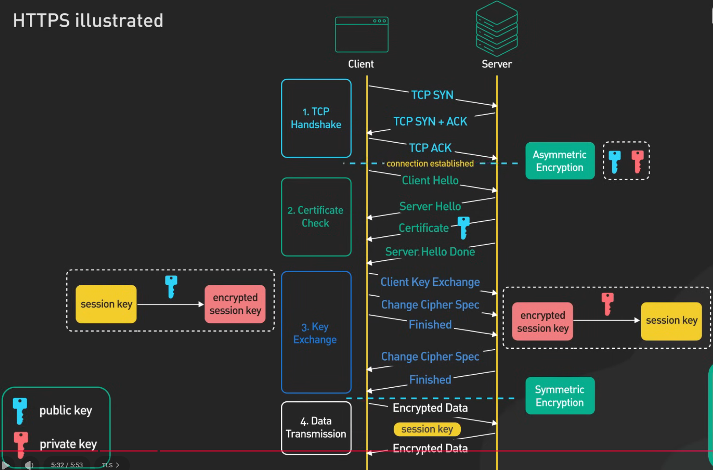

## HTTPS (HyperText Transfer Protocol Secure)

- **HTTPS** is an extension of the **HTTP** protocol.
- It provides **secure communication** over a network by encrypting data exchanged between client and server.
- All data exchanged is **encrypted**, so attackers cannot read or modify it.
- **HTTPS = HTTP over SSL/TLS** original SSL(Secure Socket Layer) is used but now tls(Transport layer security) is used
---

### 1. TCP Handshake

Before HTTPS starts, a **TCP 3-way handshake** is performed to establish a connection.
Connection is now established.

---

### 2. Certificate Check (TLS Handshake)

1. **Client Hello**
   - Client sends supported TLS versions and cipher suites -> set of cryptographic algorithms for secure connection
   - TLS_ECDHE_RSA_WITH_AES_128_GCM_SHA256

2. **Server Hello**
   - Server selects TLS version and cipher suite.
   - Server sends its **digital certificate** (contains public key).

3. **Certificate Verification**
   - Client verifies the certificate using a trusted **Certificate Authority (CA)**.

---

### 3. Asymmetric Encryption

- Uses a **public key** and a **private key**.
- Server shares its **public key** via the certificate.
- Client uses this public key to encrypt sensitive information.

Used mainly during **key exchange**, not for bulk data.

---

### 4. Key Exchange

- Client and Server uses same encryption key to encrypt - Symmetric Encryption
- Client generates a **session key** (symmetric key).
- Session key is encrypted using the server’s **public key**.
- Server decrypts it using its **private key**.
- Now both sides hold the session key

### 5. Data Transmission
- Now data is encrypted using symettric Encryption key

### 6. Why not use Asymmetric Key?
- Asymmetric is compuational expensive

