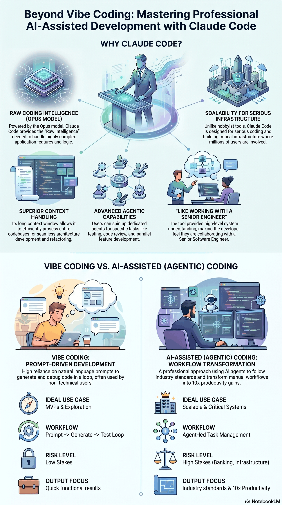
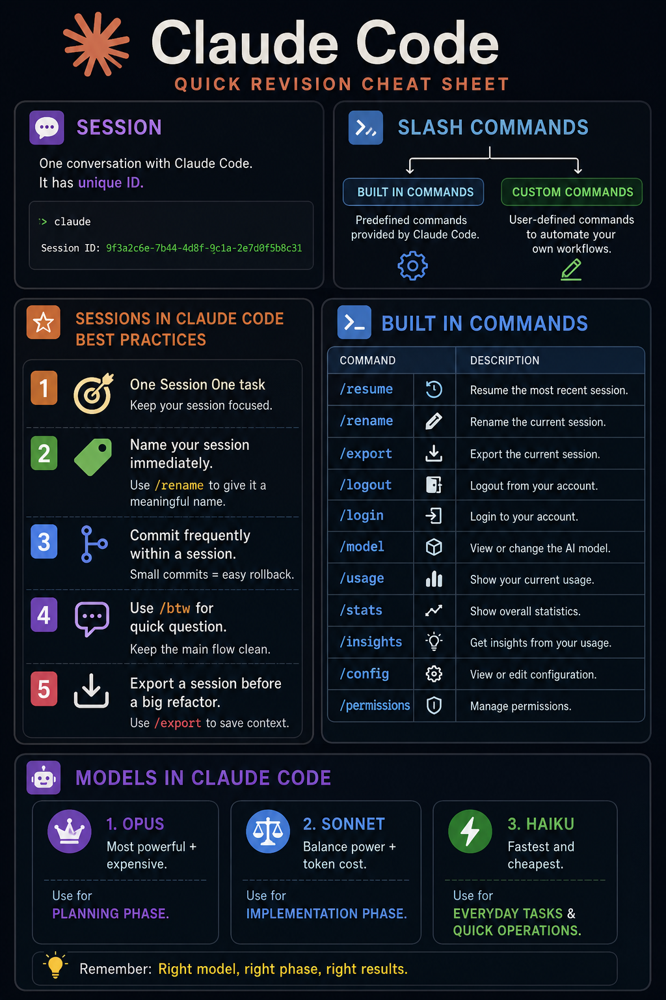
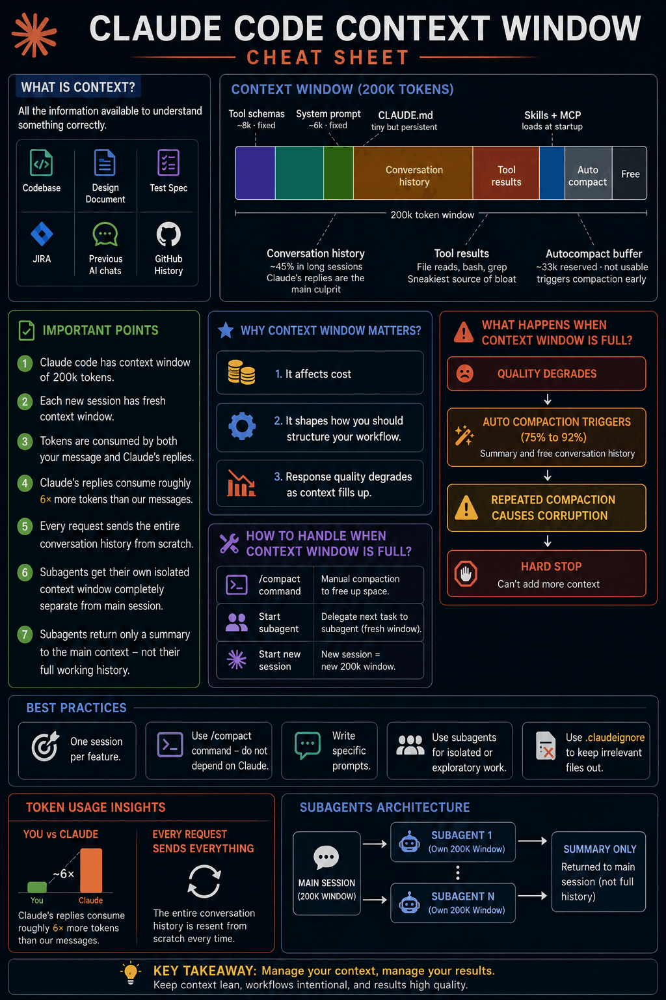
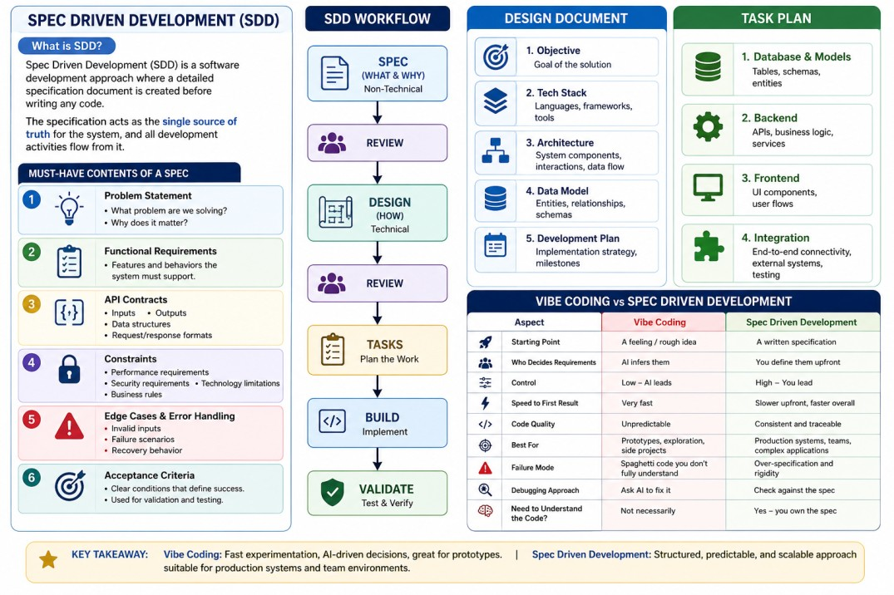
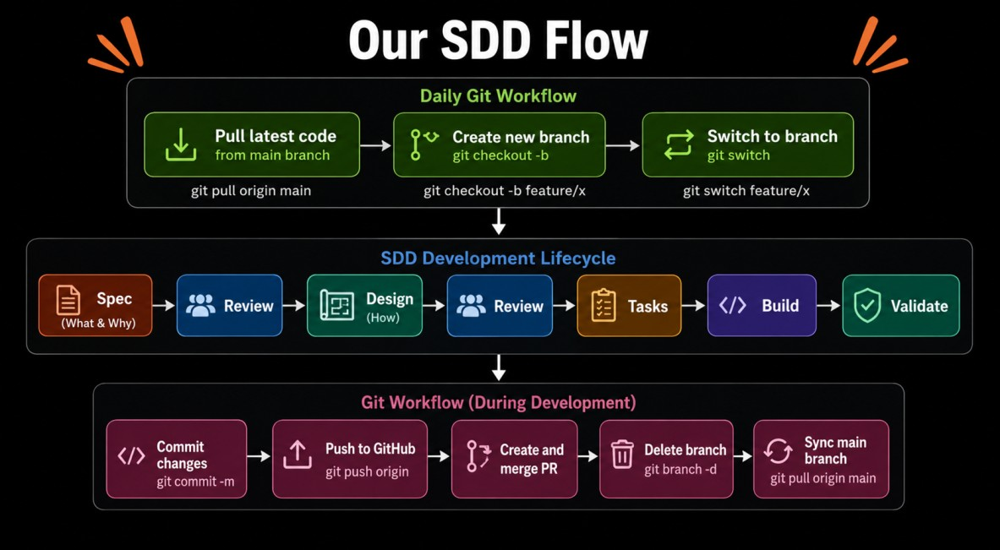
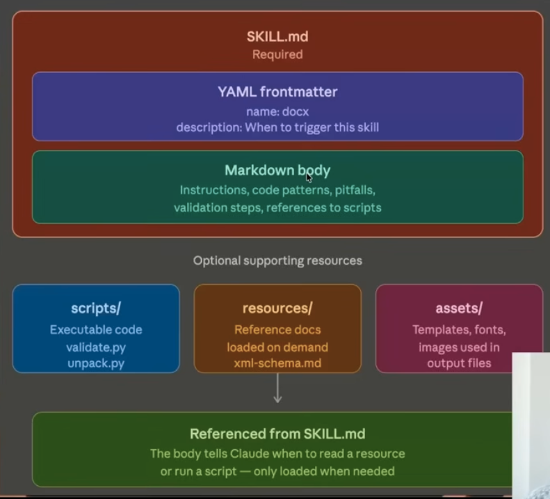

# Claude Code


## Problem with Vibe Coding
- Hidden bugs and edge cases
- Inconsistent architecture

## Claude Code Slash Commands



### Understanding new code

1. What does this project do?
2. Which tech stack does this project use?
3. Explain the project structure to me.
4. Write clear prompt and use @{filepath}

## Context Window Management



## Why `CLAUDE.md`?

LLM-based tools like Claude do not remember previous sessions.  
Repeating instructions every session is:
- Time consuming
- Error-prone
- Leads to inconsistent code generation

`CLAUDE.md` acts as persistent project context for Claude.

It typically contains:
- Project structure
- Coding conventions
- Run/build/test commands
- Preferred tools/frameworks

---

# Creating `CLAUDE.md`

Two ways:
1. Manually
2. Using:

```bash
/init
```

---

# Why `/init` Helps

Useful when:
- Working on an existing codebase
- Large repositories
- New to `CLAUDE.md`
- Building quick prototypes

`/init`:
- Scans config files (`package.json`, `README.md`, etc.)
- Reads folder structure
- Infers tech stack and conventions

Usually:
- ~30% useful directly
- Remaining should be customized manually

---

# What `CLAUDE.md` Should Have

## Project Context
Short description of the project.

## Architecture
Where routes, services, schemas, repositories live.

Example:
- Routes live in `routers/` — define endpoints, handle HTTP in/out
- Business logic lives in `services/` — core app logic, orchestration
- Schemas live in `schemas/` — request/response validation and serialization
- Persistence logic lives in `repository/` — all database queries

## Code Style

Example:
- Use type hints
- Keep functions small
- Prefer existing patterns

## Commands
Lists exact commands for running, testing, and
maintaining the project
- Install dependencies: `pip install -r requirements.txt`
- Run dev server: `uvicorn main:app --reload`
- Run tests: `pytest`

## Preferred Libraries

Specify allowed frameworks/tools like
- Use FastAPI for APIs
- Use Pydantic for validation
- Use SQLAlchemy for ORM
- Do not introduce new dependencies unless necessary

## Critical Rules

Important warnings and constraints like 
- Do not modify "database.py' unless absolutely
necessary.
- Patient IDs are provided by the client; do not
auto-generate UUIDs.

---

# `.claude` Folder

Stores Claude configuration:
- Skills
- Custom commands
- Sub-agents
- Project workflows

Types:
- `CLAUDE.md` → shared project config
- `CLAUDE.local.md` → personal gitignored config
- `~/.claude/CLAUDE.md` → global preferences
- Subdirectory `CLAUDE.md` → folder-specific rules

---

# Good Practices

- Start with `/init`, then prune
- Keep under ~200 lines
- Only add rules that prevent mistakes
- Commit to git
- Use emphasis IMPORTANT only if needed
- Treat it as a living document
- Only put universal things applicable to full project.
- Audit periodically

Rule:
> If removing a rule changes nothing, delete it.

---

# Large Repositories

Split rules(Loaded Lazily) into:

```bash
.claude/rules/
```

Examples:
- `code-style.md`
- `testing.md`
- `security.md`

Reference docs using:

```md
See @docs/api-guidelines.md
```

---

# Auto Memory

Claude can store persistent project learnings. Only first 200 likes of memory.md is loaded so maintain properly.

Example:
> “Project uses INR instead of USD”

Location:

```bash
~/.claude/projects/<project>/memory/
```

Useful command:

```bash
/memory
```

# Spec Drive Development



# Enterprise Workflow
Epic Design
    ↓
Task Extraction
    ↓
Task Implementation Plan
    ↓
Code
    ↓
Validation

# Best Practices: Plan Mode

- Create a Design Document before implementation.
- Use Plan Mode and store in `.claude/plans/`.
- Opus = Planning , Sonnet = Implementation.
- Enable Extended Thinking during planning.
- Effort - Medium or High

# Custom Slash Commands

- Reusable prompts invoked via `/command`
- Stored as Markdown files

Types:
- Project Scoped → `.claude/commands/`
- User Scoped → `~/.claude/commands/`

Examples:
- `/review` → Code review
- `/commit` → Generate commit message
- `/test` → Run tests
- `/security-scan` → Security checks

Benefits:
- Automate workflows
- Improve consistency
- Save time

# Skills
**Purpose:** Convert Claude from a generalist into a specialist.

### Example: PPT Generation
**Knows:** PowerPoint, slide structure, content, libraries  
**Doesn't Know:** Branding, fonts, layouts, chart placement, company standards

### Problem
LLMs don't perform well on specialized tasks.

### Traditional Solution
Write detailed prompts.

**Issues:**
- Retype every time
- Burns context window
- Hard to bundle resources
- Hard to share/version
- Hard to improve
- Prompts don't compose

### Solution: Skills

Skills are reusable, file-based resources that provide Claude with domain-specific expertise such as workflows, context, and best practices that transform general-purpose agents into specialists.

- Skills loads on demand
- No need to give same guidance across multiple sessions

### Progressive Disclosure
Core idea - don't present information until the moment
it's needed.
**L1:** Description  
**L2:** `SKILL.md`  
**L3:** Resources


### Scope
`~/.claude/skills` → Personal  
`.claude/skills` → Project

### Creation
**Methods:** Manual | `skill-creator`

**Flow to Create Skill:** Need → `SKILL.md` → Resources → Test → Refine

Read - https://medium.com/@universe3523/spec-driven-development-with-claude-code-206bf56955d0

# Subagents

## Why Subagents?

- Stateless LLMs - does not remember old interactions
- Context Window Overflow - To maintain context in task, we often resend the entire codebase in every call.
- Lost in the Middle Effect - LLMS pay most attention to start and end of context. Middle gets foggy.


## What are Subagents?

Specialized AI assistants that run in isolated contexts, perform focused tasks, and return only relevant results.

## Advantages

- Context Isolation
- Specialization (Research, Coding, Review)
- Parallelism
- Modularity (Analyze → Plan → Implement → Review → Test)

## Top Use Cases

- Codebase Exploration
- Independent Code Review
- Testing
- Multi-Stage Pipelines
- Parallel Independent Tasks
- Security Auditing

## Built-in Subagents

### Explore

- Explore and understand the codebase

### Plan

- Create implementation plans

### General Purpose

- Read and write code

## Custom Subagents

### Configuration

- Tools
- Prompt
- Model
- Permissions
- Hooks
- Skills

### Examples

- Security Reviewer
- Research Agent
- Code Writer

## Why Custom Subagents?

- Built-in agents are generic
- Enable specialized workflows
- Support custom tools, prompts, and models

## Creating Custom Subagents

1. Create a Markdown file
2. Store it in `.claude/agents`

### Storage Locations

- Project Level
- Personal Level

## Triggering Subagents
1. Automatic
2. Explicit


## Example Workflows
1. `/test-feature` - Test Writer → Test Runner
2. `/self-code-review` - Security Review → Code Quality Review

