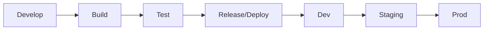
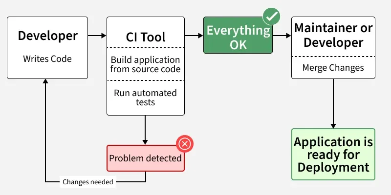
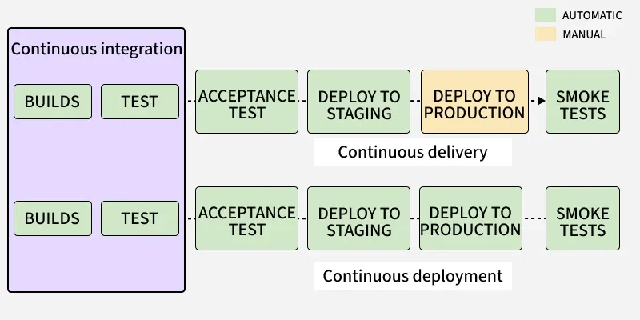
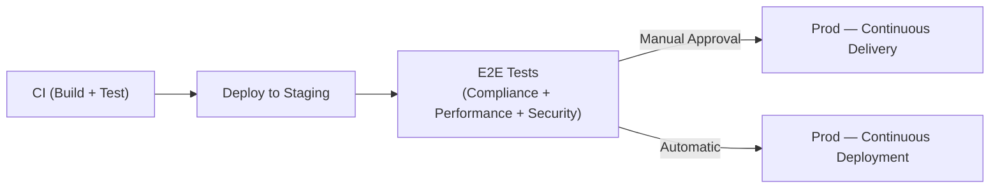
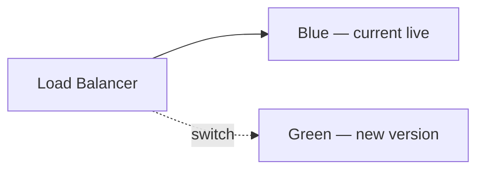
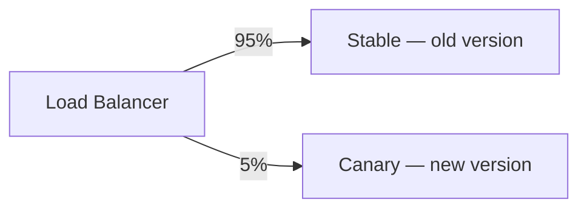
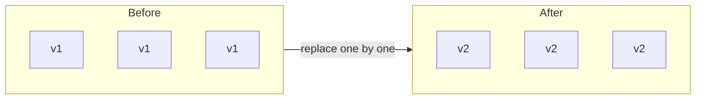

# CI/CD

## Cycle

## Definitions

- **Continuous Integration (CI)** = Automate Build + Test
- **Continuous Delivery** = CI + Automate Deploy to staging + E2E tests (manual approval to prod)
- **Continuous Deployment** = CI + Automate Deploy all the way to prod (no manual approval)

## Before CI/CD Adoption

Software delivery was slow, manual, and error-prone:

- **Integration Hell** — all branches merged at the end, causing big conflicts and broken builds
- **Late Bug Discovery** — build and test were manual and done at the final stage, so bugs were costly to fix
- **Big-Bang Releases** — everything released together, deployments took days or weeks
- **Siloed Teams** — developers wrote code, testers tested, ops managed servers — no shared ownership

## After CI/CD Adoption

Development becomes automated, faster, and more reliable:

- Developers commit code frequently to a shared repository
- CI automatically builds and tests on every commit
- Bugs are detected early and fixed quickly
- Continuous Delivery ensures code is always release-ready
- Continuous Deployment enables automatic production releases
- Smaller, frequent updates replace large risky releases
- Improves collaboration and transparency across teams

## Why CI/CD?

1. **Integration Hell** — merging long-lived branches causes massive conflicts
2. **Infrequent Releases** — slow feedback loop, risky big-bang deployments
3. **Backup/Restore is Hell** — no reliable rollback without automation

## How to Implement

1. GitHub Actions
2. Jenkins

## CI Workflow

The CI workflow represents the automated process that starts when developers commit code and ends with build status.

1. Developer writes and commits code
2. CI tool builds the application
3. Automated tests are executed
4. If issues occur → Problem Detected → developer fixes code
5. If successful → Everything OK → code is merged
6. Application becomes ready for deployment

## CI/CD Workflow

This workflow shows how CI combined with Continuous Delivery/Deployment enables faster, safer, and more reliable software releases.

1. CI performs build and test automatically
2. Code moves to Acceptance Testing
3. Deployed to Staging Environment
4. Further validation is done
5. Continuous Delivery → Manual deployment to production
6. Continuous Deployment → Automatic deployment to production
7. Smoke tests validate production release

## Delivery vs Deployment

## Deployment Strategies

### 1. Blue-Green Deployment

Two identical environments. Deploy new version to Green, test it, then switch the load balancer. Instant rollback by switching back.

### 2. Canary Deployment

Route a small percentage of traffic to the new version. Gradually increase if stable.

### 3. Rolling Deployment

Replace instances with the new version one at a time, keeping the service live throughout.
